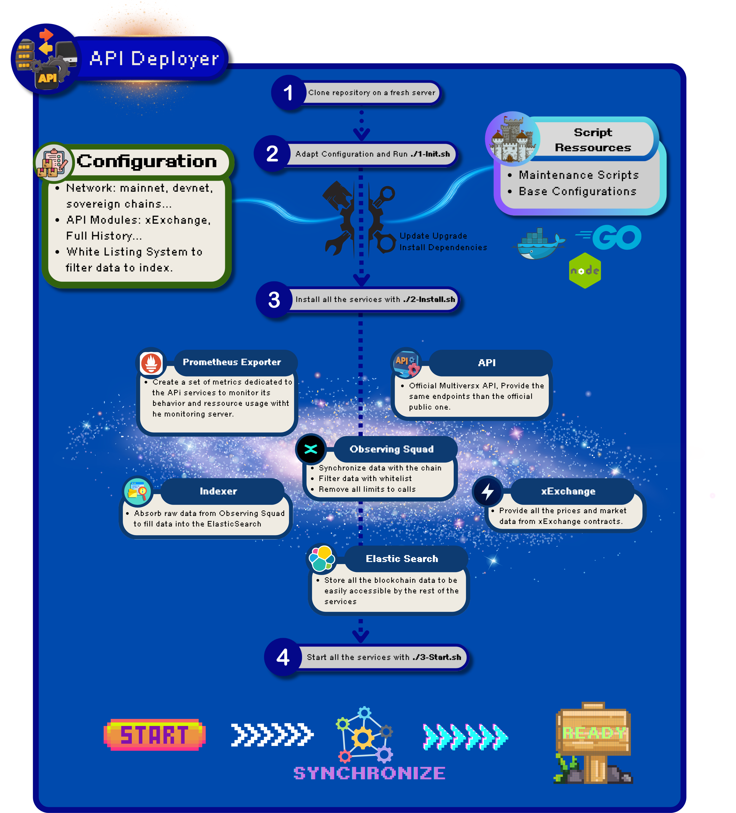

# MultiversX API Deployer

Effortlessly deploy a complete infrastructure to run your own **MultiversX API** in just a few steps. This repository streamlines the entire process, eliminating complex configurations and providing a rapid setup solution for any server.

With a focus on simplicity and automation, this deployment is designed to make the MultiversX API accessible to everyone. Whether you're a blockchain enthusiast or a seasoned developer, you can have a fully operational API in no time. No need to gather resources from multiple repositories—everything you need is here in one place.



### **Quick Start**
Deploying the infrastructure is as simple as running three commands:
1. **Initialize the server**: Set up the requirements and create a dedicated user for running services.
2. **Deploy the infrastructure**: Install the necessary services and configure the environment.
3. **Start the services**: Launch the components and expose the API for external access.


Having a complete API usually required a lot of steps from a lot of repositories, here you have it all in one place.

### **This deployment includes:**
- [**An Observing Squad**](https://docs.multiversx.com/integrators/observing-squad): Access blockchain data by running observer nodes.
- [**ElasticSearch Indexer**](https://docs.multiversx.com/sdk-and-tools/indexer/#observer-client): Convert raw blockchain data for efficient querying.
- [**ElasticSearch Database**](https://github.com/elastic/elasticsearch): Store the converted blockchain data.
- [**Kibana**](https://github.com/elastic/kibana): Visualize data and logs from the blockchain.
- [**MultiversX API**](https://docs.multiversx.com/sdk-and-tools/rest-api/multiversx-api): Query blockchain data externally via a standard API.
- [**xExchange**](https://github.com/multiversx/mx-exchange-service): The official exchange service for feed the MultiversX API.


## **0 - Prerequisites**

### **Hardware**
To support the infrastructure's heavy load, we recommend deploying on a bare-metal server with the following specifications depending on your needs:

| Network | Machine Type| CPU Cores | RAM | Storage | Bandwidth |
|---------|-------------|-----------|-----|---------|-----------|
| Mainnet |     Bare    |8-16     | 32-64 GB | 1 TB SSD | 1 Gbps |
| Devnet  |     VPS     | 4-8      | 16-32 GB | 500 GB SSD | 1 Gbps |

### **Security**
Before deployment:
- Secure your server with an **SSH key**.
- Ensure no sensitive data is on the server. Although the API is stateless, misuse of the infrastructure could disrupt services.


## **1 - Initialize Server**

1. Ensure you are logged in as the ubuntu user

2. You will need this repository on your machine before starting:
```bash
   git clone https://github.com/PhyByte/mvx-api-deployer.git
```
### **Configuration**

At the root of this repository you will find the file named config.cfg. It contains variables that can be configured to customize the deployment.

The following variables are available:
- **USERNAME**: The username on which the services will be installed.
- **NETWORK**: The network to deploy. Currently supports `mainnet`, `devnet` and `testnet` networks.

Currently, the deployment is configured with default settings. As development progresses, more configuration options will be added, such as enabling a **full history node** or customizing ElasticSearch settings.

### **Running the Initialization Script** 
3. Run the installation script that will set up the requirements for the deployment:
```bash
  cd mvx-api-deployer
   ./1-Init.sh
```

### **What this script does:**
- Updates and upgrades your system.
- Installs Docker and Docker Compose.


---

## **2 - Install Services**

As you already configured the `config.cfg` file, you can now deploy the infrastructure immediately by running: 
```bash
   cd ~/mvx-api-deployer
   ./2-Install.sh
 ```


### **What this script does:**
- Setup the Observing Squad with `ElasticSearch Indexer Enabled`.
- Setup the ElasticSearch Indexer and deploy the ElasticSearch Database with Kibana.
- Setup the MultiversX API.
- Setup the xExchange service.


## **3 - Start Services**

After the installation is complete, you can start the services by running:
```bash
   cd ~/mvx-api-deployer
   ./3-Start.sh
```

# Maintenance Section for MultiversX API Services

The installation process includes copying a pre-configured `.bashrc` file to the deployment server. This file provides a set of convenient commands to manage the MultiversX API services, including starting, stopping, monitoring, and checking the status of individual services.

## **Overview of Maintenance Commands**

### **Observing Squad Commands**
The Observing Squad allows you to access blockchain data via observer nodes. These commands help you monitor and manage the Observing Squad services.
- **Start & Stop Observing Nodes**  
  Use these commands to start and stop individual observing nodes:
  ```bash
  api_obssquad_start    # Start all observing squad nodes
  api_obssquad_stop     # Stop all observing squad nodes
  ```
- **Monitor Observing Nodes**  
  Use these commands to monitor individual observing nodes:
  ```bash
  api_obssquad_monitoring_0       # Monitor node 0 at localhost:8080
  api_obssquad_monitoring_1       # Monitor node 1 at localhost:8081
  api_obssquad_monitoring_2       # Monitor node 2 at localhost:8082
  api_obssquad_monitoring_3       # Monitor node 3 at localhost:8083
  api_obssquad_monitoring_proxy   # View logs of the observing squad proxy service
  ```


  ### **ElasticSearch Indexer Commands**
  The ElasticSearch Indexer processes raw blockchain data into structured data for querying.

- ** Start & Stop ElasticSearch Indexer**  
  Use these commands to start and stop the ElasticSearch Indexer:
  ```bash
  api_indexer_start    # Start the ElasticSearch Indexer
  api_indexer_stop     # Stop the ElasticSearch Indexer
  ```

  ### **ElasticSearch & Kibana Commands**
  The ElasticSearch Database stores the converted blockchain data.
  ```bash
  api_eskibana_start    # Start ElasticSearch and Kibana
  api_eskibana_stop     # Stop ElasticSearch and Kibana
  ```

   ### **MultiversX API Commands**
   The MultiversX API provides external REST access to blockchain data.

- **Start & Stop MultiversX API**
  Use these commands to start and stop the MultiversX API:
  ```bash
  api_mx_api_start    # Start the MultiversX API
  api_mx_api_stop     # Stop the MultiversX API
  ```

  ### **Check Status of All Services**
   Use this command to check the status of all services:
   ```bash
   api_check_status    # Check the status of all services
   ```

## Adding Custom Commands
You can add custom commands to the `.bashrc` file to manage additional services or configurations that you would need to run your own MultiversX API. This is usually better than retyping the commands every time.